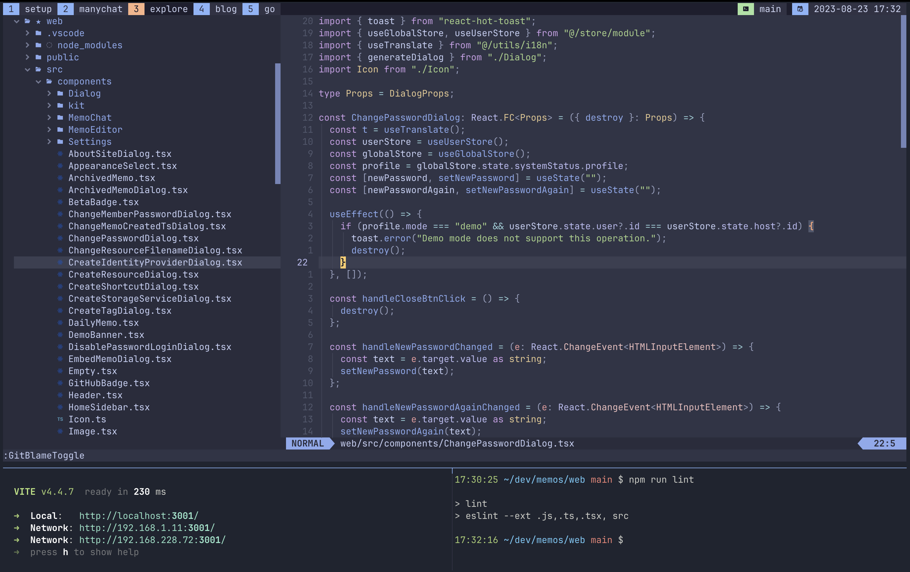

# Terminal IDE powered by Neovim and Tmux

## Overview, UI and features

  
Trouble Neovim plugin for smart code navigation through references and definitions

  

    </img>
  

  
Diffview Neovim plugin to keep track of all changes

  

    </img>
  

  
Telescope Neovim plugin to fuzzy-search basically anything

  

    </img>
  

  
Code Actions Neovim plugin for contextual code actions from LSP

  

    </img>
  

  
Which Key Neovim plugin for creating keymaps that stick and make sense

  

    </img>
  

  
Mason Neovim plugin for LSP package management

  

    </img>
  

  
Lazygit CLI tool as a git wrapper

  

    </img>
  

  
Zen Mode with zen-mode Neovim plugin

  

    </img>
  

  
Instance stats with gotop CLI tool

  

    </img>
  

